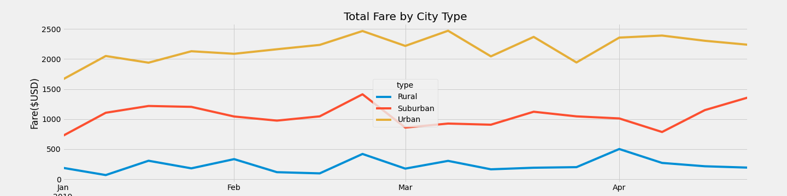

# PyBer_Analysis
## Project Overview
### Using Matplotlib to analyze rideshare data and create a compelling visualization to help improve access to ride-sharing services and determine affordability for underserved neighborhoods.

#### The following Panda analysis of rideshare data was used to create:
- Merged DataFrames
- Summary DataFrame of the ride-sharing data by city type
  - The total number of rides 
  - The total number of drivers
  - The total amount of fares
  - Average fare per ride 
  - Average fare per driver
- A multiple-line graph that shows the total weekly fares for each city type

### Resources
- Data Source: (1) city_data.csv; (2) ride_data.csv
- Software: pandas 1.3.4, Jupyter notebook 

## Results
 - Differences in ride-sharing data among the different city types:
   - 
   
   
 - Although the total number of rides for the Urban area was 13x the amount for the rural area, the average fare per ride was 41% more for rural customers versus urban customers. 
 - The average fare per driver was 335% more in the rural area when compared to the urban area. 
 - In the rural area 78 drivers completed 125 rides or 1.6 rides per driver. Meaning less available drivers whichs drives up rates.
 - In the urban area 2405 drivers completed 1625 rides or 0.67 rides per driver. Meaning more competition for drivers which drives down rates.

## Summary
-  In general, median household income is higher in urban counties than in rural areas. Likewise, poverty rates tend to be lower in urban areas than in rural areas (U.S. Census, 2013-2017 5 year estimates).
-  Underserved communities lack equal access to affordable, reliable transportation
#### Business recommendation #1
- Create an incentive program to introduce more drivers in rural areas to help bring down average fare prices. 

#### Business recommendation #2
- Partner with Goodwill®, or United Way® to distribute donated rides to help job seekers get to job training, interview prep, interviews, and/or new jobs. 

#### Business recommendation #3
- Partner with local health care systems and hospitals to distribute donated rides to help rural citizens get access to care, which in turn helps keep health care costs down for the health system.
